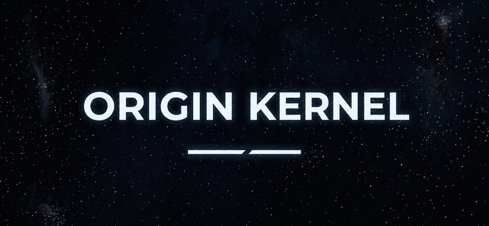

# 🔥 Origin Kernel for Nothing Phone (3a) Lite/ CMF by Nothing Phone 2 Pro

  

> [!CAUTION]
> ## Your warranty is no longer valid!
> I am **not responsible** for bricked devices, damaged hardware, or any issues that arise from using this kernel.
> **Please** do thorough research and fully understand the features included in this kernel before flashing it!
> By flashing this kernel, **YOU** are choosing to make these modifications. If something goes wrong, **do not blame me**!

---

### 🚨 Proceed at your own risk!

---

> [!NOTE]
> ## Features
>
> - ✅ [**KernelSU-Next**](https://github.com/KernelSU-Next/KernelSU-Next): KernelSU-Next is a root solution for Android GKI devices, it works in kernel mode and grants root permission to userspace applications directly in kernel space.
> - ✅ [**SUSFS**](https://gitlab.com/simonpunk/susfs4ksu): An addon root hiding kernel patches and userspace module for KernelSU.
> - ✅ [**Droidspaces-OSS**](https://github.com/ravindu644/Droidspaces-OSS): A lightweight, LXC-like container runtime for Android and Linux. Run full Linux distributions natively with zero performance penalty
> - ✅ [**Baseband-Guard**](https://github.com/vc-teahouse/Baseband-guard): A lightweight LSM (Linux Security Module) for the Android kernel, designed to block unauthorized writes to critical partitions/device nodes at the system level.
> - ⌛ [**Nethunter**](https://www.kali.org/docs/nethunter/): Open-source Android penetration testing platform for Android devices.
> - ⌛ ZRAM LZ4 compression
> ### Networking Improvements:
> - ⌛ BBRv1 - Improved TCP congestion control
> - ⌛ IP Set & IPv6 NAT Support - Advanced firewall capabilities
> - ⌛ TTL Target Support - Network packet manipulation
> ### Other Features
> - ✅ TMPFS_XATTR - Extended attributes for tmpfs (Mountify support)
> - ✅ TMPFS_POSIX_ACL - POSIX ACLs for tmpfs
> - ⌛ MemKernel - An Android kernel driver for reading/writing physical memory.

----

> [!TIP]
> ## Installation instructions:
> ### Prerequisites
> - Unlocked bootloader.
> - Backup your current boot image.
> - Have root access using Magisk / KernelSU / Apatch (Any forks).
>  ### Via Kernel Flasher
> - Download the correct AnyKernel3 ZIP for your device(Galaga/Galaxian).
> - If you previously used another root method, clean it up first:
> - **a. Magisk**: perform a complete uninstall after flashing the AnyKernel3 ZIP.
> - **b. KSU LKM** (boot/init_boot/vendor_boot‑patched): Flash back the stock boot/init_boot/vendor_boot depending on what you patched.
> - **c. KSU GKI**: if you are 100% sure you already flashed stock init_boot/boot/vendor_boot, no action is needed; otherwise, follow the same steps as KSU LKM.
> - **d. APatch**: remove /data/adb contents to avoid leftover root conflicts after flashing the AnyKernel3 ZIP.
> - Flash the ZIP to the active slot using Kernel Flasher.
> - Install the KernelSU‑Next Manager APK, same version as mentioned in the release notes.
> - Open the KernelSU‑Next app.
> - Reboot the device if you performed any cleanup in step 2
> ### Via KernelSU/KernelSU Next App
> - If you are rooted with KernelSU/KernelSU Next or any other forks, you can flash the AnyKernel3 zip from the manager itself.

----

> [!NOTE]
> ## Other Useful Links:
> - [Kernel Flasher - fatalcoder524 fork](https://github.com/fatalcoder524/KernelFlasher/releases/latest)
> - [Nothing Archive - spike0en](https://spike0en.github.io/nothing_archive/)
> - [Guide - Flashing Stock ROM](https://spike0en.github.io/nothing_archive/docs/guides#flashing-stock-rom-unbrick--downgrade)
> - [Hard Unbrick Guide](https://spike0en.github.io/nothing_archive/docs/guides#hard-unbrick)
> - [Telegram Updates Channel](https://t.me/s/CMFPhone2GlobalUpdates)
> - [Telegram Chat](https://t.me/CMFPhone2_Global)

----

> [!IMPORTANT]
> ## Credits
>
> - **KernelSU**: Developed by [tiann](https://github.com/tiann/KernelSU).
> - **KernelSU-Next**: Developed by [rifsxd](https://github.com/KernelSU-Next/KernelSU-Next).
> - **Magic-KSU**: Developed by [5ec1cff](https://github.com/5ec1cff/KernelSU).
> - **SUSFS**: Developed by [simonpunk](https://gitlab.com/simonpunk/susfs4ksu.git).
> - **SUSFS Module**: Developed by [sidex15](https://github.com/sidex15).
> - **Sultan Kernels**: Developed by [kerneltoast](https://github.com/kerneltoast).
> - **Kernel Flasher**: Developed by [fatalcoder524](https://github.com/fatalcoder524)
> - **Baseband-guard (BBG)**: Developed by [vc-teahouse](https://github.com/vc-teahouse/Baseband-guard)
> Special thanks to all my friends and the nothing community for all the help they did

----

> [!WARNING]
> ## Disclaimer
>
> Flashing this kernel will void your warranty, and there is always a risk of bricking your device. Please make sure to back up your data and ensure you understand the risks before proceeding.
>
> **Proceed at your own risk!**

----

